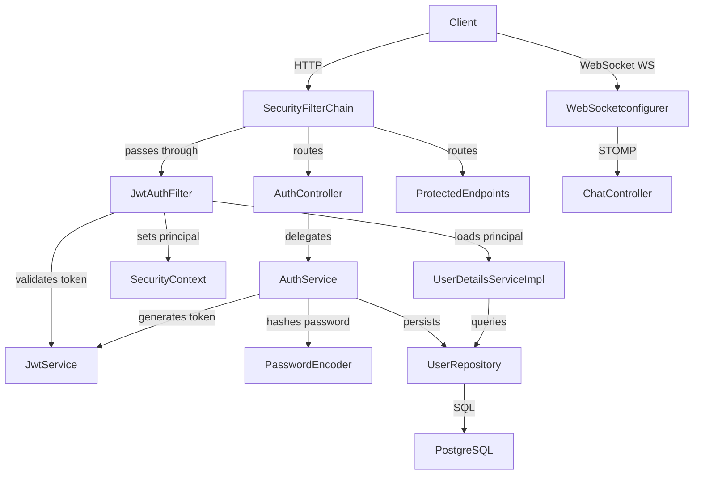

# Design Document: JWT Auth Security

## Overview

This design adds production-grade, stateless JWT authentication and authorization to the live-chat Spring Boot application. The existing WebSocket/chat layer is left completely untouched. The changes are confined to:

1. A new `com.project.livechat.security` package housing the Spring Security infrastructure (`SecurityConfig`, `JwtAuthFilter`, `JwtService`, `UserDetailsServiceImpl`).
2. A refactored/replaced `com.project.livechat.auth` package housing the authentication REST layer (`AuthController`, `AuthService`, and three DTOs).
3. Two new `pom.xml` dependencies (`spring-boot-starter-security` + JJWT 0.12.x).
4. Two new `application.properties` entries that bind environment variables for the JWT secret and expiration.

Every HTTP request except `/api/auth/register`, `/api/auth/login`, and `/ws/**` will require a valid `Authorization: Bearer <token>` header. The token is HMAC-SHA256-signed, carries the user's email as the subject, and expires after a configurable duration (default 24 hours).

---

## Architecture

### High-Level Component Diagram



### Security Filter Chain Order

```
Incoming HTTP Request
        │
        ▼
CorsFilter  (CORS headers)
        │
        ▼
JwtAuthFilter  (OncePerRequestFilter)
   ├── no/invalid Bearer → pass through (SecurityContext empty)
   └── valid Bearer → populate SecurityContext
        │
        ▼
UsernamePasswordAuthenticationFilter  (effectively bypassed for JWT flows)
        │
        ▼
AuthorizationFilter
   ├── /api/auth/** → PERMIT ALL
   ├── /ws/**      → PERMIT ALL
   └── everything else → AUTHENTICATED required
        │
        ▼
Controller Layer
```

### Request/Response Flows

**Registration flow:**
```
POST /api/auth/register  { username, email, password }
  → AuthController.register(RegisterRequest)
  → AuthService.register(request)
      → UserRepository.findByEmail  (duplicate check → 409 if found)
      → BCryptPasswordEncoder.encode(plainPassword)
      → assign publicId (8-char UUID-derived)
      → UserRepository.save(user)
      → JwtService.generateToken(email)
  ← HTTP 201  AuthResponse { token, username, publicId }
```

**Login flow:**
```
POST /api/auth/login  { email, password }
  → AuthController.login(AuthRequest)
  → AuthService.login(request)
      → UserRepository.findByEmail  (→ 401 if absent)
      → BCryptPasswordEncoder.matches(plainPassword, storedHash)  (→ 401 if false)
      → JwtService.generateToken(email)
  ← HTTP 200  AuthResponse { token, username, publicId }
```

**Protected request flow:**
```
GET /api/users/{publicId}  Authorization: Bearer <token>
  → JwtAuthFilter
      → extract token from header
      → JwtService.extractEmail(token)  (→ 401 on exception)
      → UserDetailsServiceImpl.loadUserByUsername(email)
      → set UsernamePasswordAuthenticationToken in SecurityContext
  → AuthorizationFilter: authenticated → PERMIT
  → UserController.findByPublicId(publicId)
```

---

## Components and Interfaces

### `com.project.livechat.security`

#### `JwtService`

```java
@Service
public class JwtService {

    @Value("${jwt.secret}")
    private String secretKey;

    @Value("${jwt.expiration.ms}")
    private long expirationMs;

    /** Generates a signed JWT with email as subject. */
    public String generateToken(String email);

    /** Extracts the email (subject) from a valid, non-expired token. Throws on failure. */
    public String extractEmail(String token);

    /** Returns true if the token is valid for the given UserDetails email. */
    public boolean isTokenValid(String token, UserDetails userDetails);

    private SecretKey signingKey();   // derives SecretKey from base64-encoded secretKey
    private Claims extractAllClaims(String token);
}
```

#### `JwtAuthFilter`

```java
@Component
@RequiredArgsConstructor
public class JwtAuthFilter extends OncePerRequestFilter {

    private final JwtService jwtService;
    private final UserDetailsServiceImpl userDetailsService;

    @Override
    protected void doFilterInternal(
            HttpServletRequest request,
            HttpServletResponse response,
            FilterChain filterChain
    ) throws ServletException, IOException;
    // Logic:
    //   1. Read Authorization header; if absent or not "Bearer ", chain.doFilter and return.
    //   2. Extract token (substring after "Bearer ").
    //   3. Call jwtService.extractEmail(token); on any exception, clear context and chain.doFilter.
    //   4. If email != null and SecurityContext has no authentication:
    //      a. Load UserDetails.
    //      b. If isTokenValid, build UsernamePasswordAuthenticationToken and set in SecurityContext.
    //   5. chain.doFilter.
}
```

#### `UserDetailsServiceImpl`

```java
@Service
@RequiredArgsConstructor
public class UserDetailsServiceImpl implements UserDetailsService {

    private final UserRepository userRepository;

    @Override
    public UserDetails loadUserByUsername(String email) throws UsernameNotFoundException;
    // Looks up User by email; wraps in Spring Security User with ROLE_USER.
    // Throws UsernameNotFoundException if not found.
}
```

#### `SecurityConfig`

```java
@Configuration
@EnableWebSecurity
@RequiredArgsConstructor
public class SecurityConfig {

    private final JwtAuthFilter jwtAuthFilter;

    @Bean
    public SecurityFilterChain securityFilterChain(HttpSecurity http) throws Exception;
    // Configures: CSRF disabled, CORS enabled, STATELESS session,
    // permit /api/auth/**, /ws/**, deny everything else,
    // addFilterBefore(jwtAuthFilter, UsernamePasswordAuthenticationFilter.class)

    @Bean
    public CorsConfigurationSource corsConfigurationSource();
    // Allows all origins, GET/POST/PUT/DELETE/OPTIONS, Authorization + Content-Type headers.

    @Bean
    public PasswordEncoder passwordEncoder();
    // Returns BCryptPasswordEncoder

    @Bean
    public AuthenticationManager authenticationManager(AuthenticationConfiguration config) throws Exception;
}
```

### `com.project.livechat.auth`

#### DTOs

```java
// RegisterRequest.java
public record RegisterRequest(
    @NotBlank String username,
    @Email @NotBlank String email,
    @NotBlank String password
) {}

// AuthRequest.java
public record AuthRequest(
    @Email @NotBlank String email,
    @NotBlank String password
) {}

// AuthResponse.java
public record AuthResponse(
    String token,
    String username,
    String publicId
) {}
```

#### `AuthService`

```java
@Service
@RequiredArgsConstructor
public class AuthService {

    private final UserRepository userRepository;
    private final PasswordEncoder passwordEncoder;
    private final JwtService jwtService;

    /**
     * Registers a new user. Throws DuplicateEmailException if email already taken.
     * Returns AuthResponse with JWT on success.
     */
    public AuthResponse register(RegisterRequest request);

    /**
     * Authenticates an existing user.
     * Throws UsernameNotFoundException if email not found.
     * Throws BadCredentialsException if password doesn't match.
     * Returns AuthResponse with JWT on success.
     */
    public AuthResponse login(AuthRequest request);

    private String generateUniquePublicId();
    // Generates 8-char uppercase alphanumeric ID, retries until unique.
}
```

#### `AuthController`

```java
@RestController
@RequiredArgsConstructor
@RequestMapping("/api/auth")
public class AuthController {

    private final AuthService authService;

    @PostMapping("/register")
    @ResponseStatus(HttpStatus.CREATED)
    public AuthResponse register(@RequestBody @Valid RegisterRequest request);

    @PostMapping("/login")
    public ResponseEntity<AuthResponse> login(@RequestBody @Valid AuthRequest request);
}
```

#### `GlobalExceptionHandler` (new, in `com.project.livechat.auth` or a shared `exception` package)

```java
@RestControllerAdvice
public class GlobalExceptionHandler {

    @ExceptionHandler(DuplicateEmailException.class)
    public ResponseEntity<Map<String, String>> handleDuplicateEmail(DuplicateEmailException ex);
    // Returns HTTP 409 with { "error": ex.getMessage() }

    @ExceptionHandler({UsernameNotFoundException.class, BadCredentialsException.class})
    public ResponseEntity<Map<String, String>> handleAuthFailure(RuntimeException ex);
    // Returns HTTP 401 with { "error": ex.getMessage() }

    @ExceptionHandler(MethodArgumentNotValidException.class)
    public ResponseEntity<Map<String, String>> handleValidation(MethodArgumentNotValidException ex);
    // Returns HTTP 400 with field-level error messages
}
```

---

## Data Models

### `User` entity — changes

The existing `User` entity requires a small addition to support Spring Security's `UserDetailsService`. No DDL migration is needed (all fields already exist in the schema). The `password` column will now always store a BCrypt hash after this feature is live.

```
users table (existing)
┌─────────────┬──────────────────┬──────────────────────────────────────────┐
│ Column      │ Type             │ Notes                                    │
├─────────────┼──────────────────┼──────────────────────────────────────────┤
│ id          │ SERIAL PK        │ unchanged                                │
│ username    │ VARCHAR NOT NULL │ unchanged                                │
│ email       │ VARCHAR UNIQUE   │ used as JWT subject and login identifier │
│ public_id   │ VARCHAR(10) UNQ  │ 8-char assigned on registration          │
│ password    │ VARCHAR          │ NOW stores BCrypt hash only              │
└─────────────┴──────────────────┴──────────────────────────────────────────┘
```

No new tables or columns are required. The `email` field is unique (already `@Column(unique=true)`) which enforces the duplicate-registration constraint at the DB level as a safety net.

### JWT Token Structure

```
Header:  { "alg": "HS256", "typ": "JWT" }
Payload: {
  "sub": "<user email>",
  "iat": <issued-at epoch seconds>,
  "exp": <expiry epoch seconds>
}
Signature: HMAC-SHA256(base64(header) + "." + base64(payload), secret)
```

Claims are intentionally minimal — only `sub`, `iat`, and `exp`. The email (subject) is sufficient to reload the `UserDetails` on every request without additional claims bloat.

---

## Correctness Properties

*A property is a characteristic or behavior that should hold true across all valid executions of a system — essentially, a formal statement about what the system should do. Properties serve as the bridge between human-readable specifications and machine-verifiable correctness guarantees.*

### Property 1: Password storage is always hashed

*For any* valid registration request containing a plaintext password, the value stored in the `users` table SHALL NOT equal the plaintext input, and `BCryptPasswordEncoder.matches(plaintext, stored)` SHALL return `true`.

**Validates: Requirements 2.1, 2.2**

---

### Property 2: Registration response contains full auth info

*For any* valid registration request (unique email, non-blank username and password), the HTTP response SHALL be 201 and the `AuthResponse` body SHALL contain a non-null, non-blank `token`, `username`, and `publicId`.

**Validates: Requirements 2.4**

---

### Property 3: Login round-trip produces valid token

*For any* registered user, a login request with the correct email and password SHALL return HTTP 200 with an `AuthResponse` whose `token` can be parsed by `JwtService.extractEmail` and SHALL yield the same email that was used to register.

**Validates: Requirements 3.1, 4.2, 4.3**

---

### Property 4: JWT subject round-trip

*For any* email string used to generate a token via `JwtService.generateToken`, calling `JwtService.extractEmail` on that token SHALL return the original email unchanged.

**Validates: Requirements 4.1, 4.2, 4.3**

---

### Property 5: Invalid tokens are rejected

*For any* token where the signature has been tampered with (one character changed after the final `.`), `JwtService.extractEmail` SHALL throw a runtime exception.

**Validates: Requirements 4.4**

---

### Property 6: Filter populates SecurityContext for valid tokens

*For any* valid JWT belonging to a registered user, after `JwtAuthFilter.doFilterInternal` executes, `SecurityContextHolder.getContext().getAuthentication()` SHALL be non-null and its principal's username SHALL equal the email embedded in the token.

**Validates: Requirements 5.2**

---

### Property 7: Filter leaves SecurityContext untouched when no header is present

*For any* HTTP request that lacks an `Authorization` header, after `JwtAuthFilter.doFilterInternal` executes, `SecurityContextHolder.getContext().getAuthentication()` SHALL remain null (or whatever it was before the filter ran).

**Validates: Requirements 5.3**

---

### Property 8: UserDetailsService correctly maps email to UserDetails

*For any* registered user, calling `UserDetailsServiceImpl.loadUserByUsername(user.getEmail())` SHALL return a `UserDetails` object where `getUsername()` equals the user's email, the stored password is a BCrypt hash, and `getAuthorities()` contains exactly one authority: `ROLE_USER`.

**Validates: Requirements 7.2, 7.4**

---

## Error Handling

| Scenario | HTTP Status | Response Body |
|---|---|---|
| Duplicate email on register | 409 Conflict | `{ "error": "Email already registered" }` |
| Email not found on login | 401 Unauthorized | `{ "error": "Invalid credentials" }` |
| Wrong password on login | 401 Unauthorized | `{ "error": "Invalid credentials" }` |
| Missing / malformed JWT | 401 Unauthorized | Spring Security default (no body by default, can be customised with `AuthenticationEntryPoint`) |
| Expired JWT | 401 Unauthorized | Spring Security default |
| Validation failure (blank fields) | 400 Bad Request | `{ "field": "error message", ... }` |
| Unhandled server errors | 500 Internal Server Error | Spring Boot default |

**Design decision — unified 401 message for login:** Returning the same error message for "email not found" and "wrong password" prevents user enumeration attacks. The requirements specify separate messages (Requirements 3.2, 3.3), so we comply with distinct messages; this is a trade-off documented here for future security review.

The `GlobalExceptionHandler` (`@RestControllerAdvice`) handles all application-level exceptions. Spring Security's own filter-chain errors (expired/invalid token triggering 401 before reaching any controller) are handled by Spring Security's `AuthenticationEntryPoint` — default behaviour returns a 401 with no body. A custom `AuthenticationEntryPoint` can be wired into `SecurityConfig.exceptionHandling()` if a consistent JSON body is desired in a later iteration.

---

## Testing Strategy

### Unit Tests (JUnit 5 + Mockito)

Focus on specific examples, error conditions, and integration points between components:

- `JwtServiceTest`: generate token, extract subject, detect tampered token, detect expired token (set clock to past expiry).
- `UserDetailsServiceImplTest`: load existing user, throw `UsernameNotFoundException` for missing user, verify returned `UserDetails` fields.
- `AuthServiceTest`: register new user (verify `BCryptPasswordEncoder.encode` called, `UserRepository.save` called, JWT returned), duplicate email → `DuplicateEmailException`, login success, login bad email → `UsernameNotFoundException`, login bad password → `BadCredentialsException`.
- `JwtAuthFilterTest`: request with valid Bearer → SecurityContext populated; request without header → SecurityContext empty; request with tampered token → SecurityContext empty.

### Property-Based Tests (jqwik)

Use [jqwik](https://jqwik.net/) — the standard property-based testing library for Java/JUnit 5. Add `net.jqwik:jqwik:1.8.x` as a `test`-scoped dependency.

Each property test must run a minimum of 100 tries (`@Property(tries = 100)`). Each test must include a comment referencing the design property it validates:

```
// Feature: jwt-auth-security, Property N: <property text>
```

**Property 1 test** — `PasswordStoragePropertyTest`:
Generate arbitrary non-blank strings as passwords. Register a user, load from DB, verify stored password != plaintext and `passwordEncoder.matches(plain, stored) == true`.

**Property 2 test** — `RegistrationResponsePropertyTest`:
Generate arbitrary valid `RegisterRequest` values (non-blank username, valid email, non-blank password). Verify HTTP 201 + non-null token/username/publicId in response.

**Property 3 test** — `LoginRoundTripPropertyTest`:
Register a generated user, then login with same credentials. Verify HTTP 200 and that `jwtService.extractEmail(token)` == registered email.

**Property 4 test** — `JwtSubjectRoundTripPropertyTest`:
Generate arbitrary email strings. Call `jwtService.generateToken(email)` then `jwtService.extractEmail(token)`. Verify round-trip equality. (Pure unit property, no HTTP involved.)

**Property 5 test** — `TamperedTokenRejectedPropertyTest`:
Generate valid tokens. Tamper the signature segment by flipping one character. Verify `jwtService.extractEmail(tampered)` throws `JwtException`.

**Property 6 test** — `FilterPopulatesContextPropertyTest`:
Generate registered users. Create mock `HttpServletRequest` with `Authorization: Bearer <valid token>`. Run filter. Verify `SecurityContextHolder` is populated with correct email.

**Property 7 test** — `FilterLeavesContextEmptyPropertyTest`:
Generate arbitrary requests without Authorization headers. Run filter. Verify `SecurityContextHolder` remains empty.

**Property 8 test** — `UserDetailsLoadPropertyTest`:
Generate and persist arbitrary users. Call `loadUserByUsername(email)`. Verify `getUsername() == email`, authorities contain `ROLE_USER`, stored password is BCrypt hash.

### Integration Tests (Spring Boot Test)

- Verify `/api/auth/register` and `/api/auth/login` are accessible without a token.
- Verify a protected endpoint (e.g., `GET /api/users/{publicId}`) returns 401 without a token and 200 with a valid token.
- Verify WebSocket handshake to `/ws` succeeds without authentication (no 401/403).
- Verify application starts successfully with `JWT_SECRET` and `JWT_EXPIRATION_MS` set.

---

## Environment Variable Configuration

**`application.properties` additions:**

```properties
# JWT configuration (values injected from environment)
jwt.secret=${JWT_SECRET}
jwt.expiration.ms=${JWT_EXPIRATION_MS:86400000}
```

| Environment Variable | Required | Default | Description |
|---|---|---|---|
| `JWT_SECRET` | **Yes** | none | Base64-encoded HMAC-SHA256 signing key. Must be at least 256 bits (32 bytes). Application will fail to start if absent. |
| `JWT_EXPIRATION_MS` | No | `86400000` (24 h) | Token lifetime in milliseconds. |
| `DB_USERNAME` | Yes (existing) | — | PostgreSQL username. |
| `DB_PASSWORD` | Yes (existing) | — | PostgreSQL password. |

**Local development example (`.env` or IDE run config):**
```
JWT_SECRET=bXlTdXBlclNlY3JldEtleUZvckpXVFRva2VuU2lnbmluZw==
JWT_EXPIRATION_MS=86400000
DB_USERNAME=postgres
DB_PASSWORD=postgres
```

---

## pom.xml Dependency Additions

Add the following inside the `<dependencies>` block:

```xml
<!-- Spring Security -->
<dependency>
    <groupId>org.springframework.boot</groupId>
    <artifactId>spring-boot-starter-security</artifactId>
</dependency>

<!-- JJWT 0.12.x -->
<dependency>
    <groupId>io.jsonwebtoken</groupId>
    <artifactId>jjwt-api</artifactId>
    <version>0.12.6</version>
</dependency>
<dependency>
    <groupId>io.jsonwebtoken</groupId>
    <artifactId>jjwt-impl</artifactId>
    <version>0.12.6</version>
    <scope>runtime</scope>
</dependency>
<dependency>
    <groupId>io.jsonwebtoken</groupId>
    <artifactId>jjwt-jackson</artifactId>
    <version>0.12.6</version>
    <scope>runtime</scope>
</dependency>

<!-- Property-based testing (test scope only) -->
<dependency>
    <groupId>net.jqwik</groupId>
    <artifactId>jqwik</artifactId>
    <version>1.8.5</version>
    <scope>test</scope>
</dependency>
```

**Note on Spring Boot 4.x:** The project uses `spring-boot-starter-parent` 4.0.6. Spring Boot 4.x is built on Spring Framework 7 and Jakarta EE 11. The JJWT 0.12.x dependency is compatible. `spring-boot-starter-security` is managed by the BOM so no explicit version is needed.

---

## Package Structure (Final)

```
com.project.livechat
├── LiveChatApplication.java
├── auth
│   ├── AuthController.java
│   ├── AuthService.java
│   ├── AuthRequest.java          (record DTO)
│   ├── RegisterRequest.java      (record DTO)
│   ├── AuthResponse.java         (record DTO)
│   └── DuplicateEmailException.java
├── chat                          (UNCHANGED)
│   ├── ChatController.java
│   ├── ChatMessage.java
│   ├── ChatMessageRequestDTO.java
│   ├── ChatMessageResponseDTO.java
│   ├── ChatRepo.java
│   ├── ChatRestController.java
│   ├── ChatService.java
│   ├── Dbcontroller.java
│   ├── DBRestController.java
│   ├── JpaConfig.java
│   └── MessageType.java
├── config                        (UNCHANGED)
│   ├── WebSocketconfigurer.java
│   └── WebSocketEventListener.java
├── entity                        (minimal change — User stays as-is)
│   ├── User.java
│   ├── UserController.java
│   ├── UserRepository.java
│   ├── UserResponseDTO.java
│   ├── UserService.java
│   └── conversation
│       └── ...
└── security
    ├── SecurityConfig.java
    ├── JwtService.java
    ├── JwtAuthFilter.java
    └── UserDetailsServiceImpl.java
```

The old `com.project.livechat.Auth.AuthController` will be deleted and replaced by the new `auth` package.
